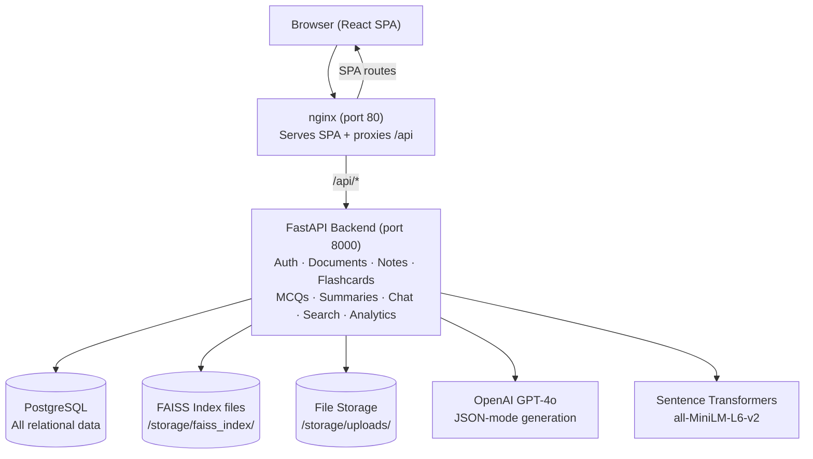
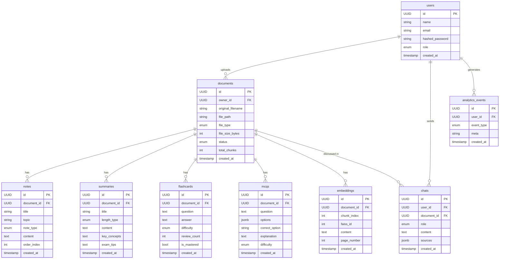

# Smart Notes Generator AI

A **production-ready AI-powered learning platform** where students, teachers, and institutions can upload educational documents (PDF, PPT, PPTX, DOCX, TXT) and automatically generate:

- Structured study notes (detailed, concise, exam revision, one-page, topic-wise)
- Chapter summaries (short, medium, detailed)
- Flashcards with flip-card review UI
- MCQs (10 / 25 / 50) with explanations
- Exam preparation study guides
- AI chat with semantic search (RAG) over uploaded documents
- Analytics dashboard with charts

---

## Tech Stack

| Layer | Technology |
|---|---|
| Frontend | React 18, Vite, TypeScript, Tailwind CSS, React Query, React Router |
| Backend | Python 3.11, FastAPI, SQLAlchemy 2.0, Alembic |
| Database | PostgreSQL 16 |
| AI / LLM | OpenAI GPT-4o, LangChain, Sentence Transformers (all-MiniLM-L6-v2) |
| Vector Store | FAISS (per-document index files on disk) |
| File Processing | PyMuPDF, pdfplumber, python-pptx, python-docx |
| Auth | JWT (python-jose), bcrypt (passlib) |
| Deployment | Docker, Docker Compose, nginx |

---

## Architecture Diagram



---

## Database ER Diagram



---

## API Reference

### Authentication

| Method | Route | Description | Auth |
|---|---|---|---|
| `POST` | `/api/v1/auth/register` | Register new user | No |
| `POST` | `/api/v1/auth/login` | Login and get JWT | No |
| `GET` | `/api/v1/auth/me` | Get current user profile | JWT |

**Register body:** `{ "name": str, "email": str, "password": str }`
**Login body:** `{ "email": str, "password": str }`
**Response:** `{ "access_token": str, "token_type": "bearer", "user": UserOut }`

---

### Documents

| Method | Route | Description |
|---|---|---|
| `POST` | `/api/v1/documents/upload` | Upload files (multipart/form-data, field: `files`) |
| `GET` | `/api/v1/documents` | List user's documents (`?skip=0&limit=50`) |
| `GET` | `/api/v1/documents/{id}` | Get document details |
| `GET` | `/api/v1/documents/{id}/status` | Poll processing status |
| `DELETE` | `/api/v1/documents/{id}` | Delete document + vectors |

---

### Notes

| Method | Route | Description |
|---|---|---|
| `POST` | `/api/v1/documents/{id}/notes/generate` | Generate notes |
| `GET` | `/api/v1/documents/{id}/notes` | List generated notes |

**Generate body:** `{ "note_types": ["detailed", "concise", "exam_revision", "one_page", "topic_wise"] }`

---

### Summaries

| Method | Route | Description |
|---|---|---|
| `POST` | `/api/v1/documents/{id}/summaries/generate` | Generate summary |
| `GET` | `/api/v1/documents/{id}/summaries` | List summaries |

**Generate body:** `{ "length_type": "short" | "medium" | "detailed", "chapter": str | null }`

---

### Flashcards

| Method | Route | Description |
|---|---|---|
| `POST` | `/api/v1/documents/{id}/flashcards/generate` | Generate flashcards |
| `GET` | `/api/v1/documents/{id}/flashcards` | List flashcards |
| `PATCH` | `/api/v1/flashcards/{id}/review` | Update review status |

**Generate body:** `{ "count": int, "difficulty": "easy" | "medium" | "hard" | null }`

---

### MCQs

| Method | Route | Description |
|---|---|---|
| `POST` | `/api/v1/documents/{id}/mcqs/generate` | Generate MCQs |
| `GET` | `/api/v1/documents/{id}/mcqs` | List MCQs |

**Generate body:** `{ "count": 10 | 25 | 50, "difficulty": "easy" | "medium" | "hard" | null }`

---

### Study Guide

| Method | Route | Description |
|---|---|---|
| `POST` | `/api/v1/documents/{id}/study-guide/generate` | Generate study guide |

---

### AI Chat (RAG)

| Method | Route | Description |
|---|---|---|
| `POST` | `/api/v1/documents/{id}/chat` | Ask a question |
| `GET` | `/api/v1/documents/{id}/chat/history` | Get conversation history |

**Ask body:** `{ "question": str }`
**Response:** `{ "answer": str, "sources": [SourceCitation], "message_id": UUID }`

---

### Search

| Method | Route | Description |
|---|---|---|
| `POST` | `/api/v1/search` | Semantic / keyword / hybrid search |

**Body:** `{ "query": str, "mode": "semantic" | "keyword" | "hybrid", "document_id": UUID | null, "top_k": int }`

---

### Dashboard & Analytics

| Method | Route | Description |
|---|---|---|
| `GET` | `/api/v1/dashboard/stats` | Get summary statistics |
| `GET` | `/api/v1/dashboard/recent-activity` | Get recent activity feed |
| `GET` | `/api/v1/analytics` | Get chart data (30-day trends) |

---

## Quick Start

### Prerequisites
- Docker & Docker Compose
- An OpenAI API key

### 1. Clone and configure

```bash
git clone <repo-url> smart-notes-ai
cd smart-notes-ai

# Create root .env from template
cp .env.example .env

# Edit .env and add your OpenAI API key
nano .env
```

### 2. Start with Docker Compose

```bash
docker compose up --build
```

- Frontend: http://localhost (port 80)
- Backend API: http://localhost:8000
- API Docs (Swagger): http://localhost:8000/docs
- ReDoc: http://localhost:8000/redoc

### 3. Create your account

Open http://localhost → click **Create one** → register → start uploading!

---

## Local Development (without Docker)

### Backend

```bash
cd backend

# Create virtual environment
python -m venv venv
source venv/bin/activate  # Windows: venv\Scripts\activate

# Install dependencies
pip install -r requirements.txt

# Create .env from template
cp .env.example .env
# Edit DATABASE_URL to point to your local PostgreSQL instance
# Add your OPENAI_API_KEY

# Start PostgreSQL locally (or use Docker for just the DB)
docker run -d --name smartnotes_db \
  -e POSTGRES_USER=smartnotes \
  -e POSTGRES_PASSWORD=smartnotes \
  -e POSTGRES_DB=smartnotes_db \
  -p 5432:5432 postgres:16-alpine

# Run the dev server
uvicorn app.main:app --reload --port 8000
```

### Frontend

```bash
cd frontend
npm install

# Create .env
cp .env.example .env

npm run dev   # → http://localhost:5173
```

### Backend Tests

```bash
cd backend
pip install pytest pytest-asyncio httpx
pytest -v
```

---

## Deployment

### Railway / Render

1. Set environment variables in the platform dashboard (same as `.env`).
2. For Railway: connect the GitHub repo; add a PostgreSQL plugin; deploy backend and frontend as separate services.
3. For Render: create a PostgreSQL database; create a Web Service for the backend (start command: `uvicorn app.main:app --host 0.0.0.0 --port $PORT`); create a Static Site for the frontend (build: `npm run build`, publish dir: `dist`).

### VPS (Ubuntu 22.04)

```bash
# Install Docker
curl -fsSL https://get.docker.com | sh

# Clone repo and configure
git clone <repo-url> /opt/smart-notes-ai
cd /opt/smart-notes-ai
cp .env.example .env
nano .env  # Set OPENAI_API_KEY, SECRET_KEY

# Start
docker compose up -d --build

# Auto-restart on reboot
docker compose restart
```

---

## Security Measures

| Concern | Implementation |
|---|---|
| Passwords | bcrypt hashing (passlib) |
| Authentication | JWT (HS256, 24h expiry) |
| Authorization | Owner-scoped DB queries; RBAC decorator |
| Input validation | Pydantic schemas on all endpoints |
| File validation | Extension allowlist + size limit (50MB) |
| SQL injection | SQLAlchemy ORM (parameterized queries only) |
| XSS | React escapes by default; nginx CSP headers |
| CORS | Explicit origins list in settings |
| Rate limiting | In-memory sliding window (60 req/min per IP) |
| Secrets | Env vars only, never in code |

---

## Project Structure

```
smart-notes-ai/
├── docker-compose.yml
├── .env.example
│
├── backend/
│   ├── Dockerfile
│   ├── requirements.txt
│   ├── pytest.ini
│   ├── init.sql                    # PostgreSQL DDL (reference)
│   ├── .env.example
│   ├── storage/
│   │   ├── uploads/                # Uploaded files (per-user subdirs)
│   │   └── faiss_index/            # FAISS .index files (per-document)
│   ├── app/
│   │   ├── main.py                 # FastAPI app factory
│   │   ├── core/
│   │   │   ├── config.py           # Pydantic settings
│   │   │   ├── database.py         # SQLAlchemy engine + session
│   │   │   └── security.py         # JWT + password hashing
│   │   ├── models/                 # SQLAlchemy ORM models
│   │   │   ├── user.py
│   │   │   ├── document.py
│   │   │   ├── note.py
│   │   │   ├── summary.py
│   │   │   ├── flashcard.py
│   │   │   ├── mcq.py
│   │   │   ├── embedding.py
│   │   │   ├── chat.py
│   │   │   └── analytics.py
│   │   ├── schemas/                # Pydantic request/response schemas
│   │   ├── repositories/           # DB access layer
│   │   ├── services/               # Business logic
│   │   │   ├── file_processing.py  # Text extraction (PDF/PPTX/DOCX/TXT)
│   │   │   ├── chunking.py         # Recursive text splitter
│   │   │   ├── embeddings.py       # Sentence Transformers + FAISS
│   │   │   ├── document_pipeline.py# Orchestrates extract→chunk→embed
│   │   │   ├── prompts.py          # All LLM prompt templates
│   │   │   ├── llm_client.py       # OpenAI client wrapper
│   │   │   ├── ai_generation.py    # Notes/flashcards/MCQ/summary/RAG
│   │   │   ├── rag.py              # RAG retrieval + answer generation
│   │   │   ├── search.py           # Semantic/keyword/hybrid search
│   │   │   └── analytics_service.py
│   │   ├── api/
│   │   │   ├── deps.py             # Auth dependencies
│   │   │   ├── router.py           # Aggregated router
│   │   │   └── routes/
│   │   │       ├── auth.py
│   │   │       ├── documents.py
│   │   │       ├── notes.py
│   │   │       ├── summaries.py
│   │   │       ├── flashcards.py
│   │   │       ├── mcqs.py
│   │   │       ├── study_guide.py
│   │   │       ├── chat.py
│   │   │       ├── search.py
│   │   │       └── analytics.py
│   │   └── middleware/
│   │       ├── rate_limit.py
│   │       └── logging_middleware.py
│   └── tests/
│       ├── conftest.py
│       ├── test_security.py
│       ├── test_text_processing.py
│       ├── test_auth.py
│       └── test_documents.py
│
└── frontend/
    ├── Dockerfile
    ├── nginx.conf
    ├── package.json
    ├── vite.config.ts
    ├── tailwind.config.js
    ├── .env.example
    ├── index.html
    └── src/
        ├── main.tsx
        ├── App.tsx
        ├── index.css
        ├── api/
        │   ├── client.ts           # Axios client + auth interceptor
        │   └── endpoints.ts        # All API call functions
        ├── context/
        │   ├── AuthContext.tsx
        │   └── DocumentContext.tsx
        ├── routes/
        │   └── ProtectedRoute.tsx
        ├── types/
        │   └── index.ts            # TypeScript entity types
        ├── lib/
        │   └── utils.ts
        ├── components/
        │   ├── ui.tsx              # Button, Card, Badge, Input, Label, Loader
        │   ├── AppLayout.tsx
        │   ├── Sidebar.tsx
        │   ├── MobileSidebar.tsx
        │   ├── Navbar.tsx
        │   ├── DocumentSelector.tsx
        │   ├── DocumentRequired.tsx
        │   └── Markdown.tsx
        └── pages/
            ├── Login.tsx
            ├── Register.tsx
            ├── Dashboard.tsx
            ├── Upload.tsx
            ├── Notes.tsx
            ├── Flashcards.tsx
            ├── MCQs.tsx
            ├── Summaries.tsx
            ├── Chat.tsx
            ├── Search.tsx
            ├── Analytics.tsx
            └── Profile.tsx
```

---

## AI Prompts Summary

All prompts live in `backend/app/services/prompts.py`.

| Feature | Prompt strategy |
|---|---|
| Notes | System: expert tutor. User: generate `{note_type}` notes → JSON `{title, topic, chapter, content}` |
| Flashcards | System: flashcard specialist. User: generate `{count}` Q&A pairs → JSON `{flashcards:[...]}` |
| MCQs | System: exam question writer. User: generate `{count}` MCQs with 4 options → JSON `{mcqs:[...]}` |
| Summaries | System: academic summarizer. User: summarize at `{length_type}` → JSON with key concepts, facts, exam tips |
| Study Guide | System: exam coach. User: produce revision guide → JSON with topics, revision order, quick facts |
| RAG QA | System: grounded study assistant. User: context chunks + history + question → JSON `{answer, used_chunk_ids}` |

All prompts use `response_format={"type": "json_object"}` (OpenAI JSON mode) for reliable structured output.
